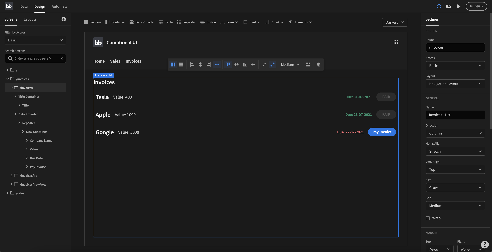

# Introduction to Design

Budibase's Design section is often described as the frontend builder within Budibase. This is where you create and build your user interface. 


Budibase apps rely on data and it is strongly advised to create your data structure before designing your web application. 


## Overview of the Design Section

The Design can be daunting when you see it for the first time, but in reality there isn't that much too it. Let's take a look at an example and go through the different parts of it.

**On the left side** you have your list of screens and components. You can also switch back and forth between Screens and Layouts. Layouts are components that wrap your screens. In the example above, if we take a look at the center of the screen, the layout in this case would be the logo, title and navigation. In subsequent pages we'll dive deeper into how to change and update the layouts.

**In the middle** we have the app preview window as well as the component picker \(the top row with buttons\). This shows you the current state of your application. Add new components by clicking on them at the top. You can also modify some of the settings from here using the toolbar.

**The right side** has all the settings for your component. They differ from component to component but generally this is where you will configure things such as data, margin and padding, states of varous kinds as well as conditionts and actions.

